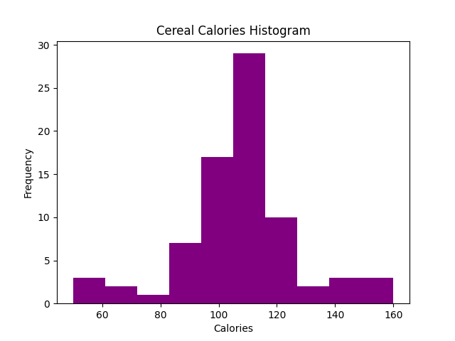
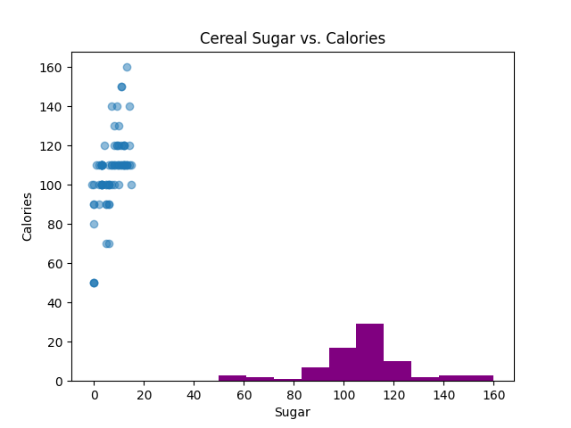

Summary:
|       |   calories |   protein |      fat |   sodium |    fiber |    carbo |   sugars |   potass |   vitamins |     shelf |    weight |      cups |   rating |
|:------|-----------:|----------:|---------:|---------:|---------:|---------:|---------:|---------:|-----------:|----------:|----------:|----------:|---------:|
| count |    77      |  77       | 77       |  77      | 77       | 77       | 77       |  77      |    77      | 77        | 77        | 77        |  77      |
| mean  |   106.883  |   2.54545 |  1.01299 | 159.675  |  2.15195 | 14.5974  |  6.92208 |  96.0779 |    28.2468 |  2.20779  |  1.02961  |  0.821039 |  42.6657 |
| std   |    19.4841 |   1.09479 |  1.00647 |  83.8323 |  2.38336 |  4.27896 |  4.44489 |  71.2868 |    22.3425 |  0.832524 |  0.150477 |  0.232716 |  14.0473 |
| min   |    50      |   1       |  0       |   0      |  0       | -1       | -1       |  -1      |     0      |  1        |  0.5      |  0.25     |  18.0429 |
| 25%   |   100      |   2       |  0       | 130      |  1       | 12       |  3       |  40      |    25      |  1        |  1        |  0.67     |  33.1741 |
| 50%   |   110      |   3       |  1       | 180      |  2       | 14       |  7       |  90      |    25      |  2        |  1        |  0.75     |  40.4002 |
| 75%   |   110      |   3       |  2       | 210      |  3       | 17       | 11       | 120      |    25      |  3        |  1        |  1        |  50.8284 |
| max   |   160      |   6       |  5       | 320      | 14       | 23       | 15       | 330      |   100      |  3        |  1.5      |  1.5      |  93.7049 |

